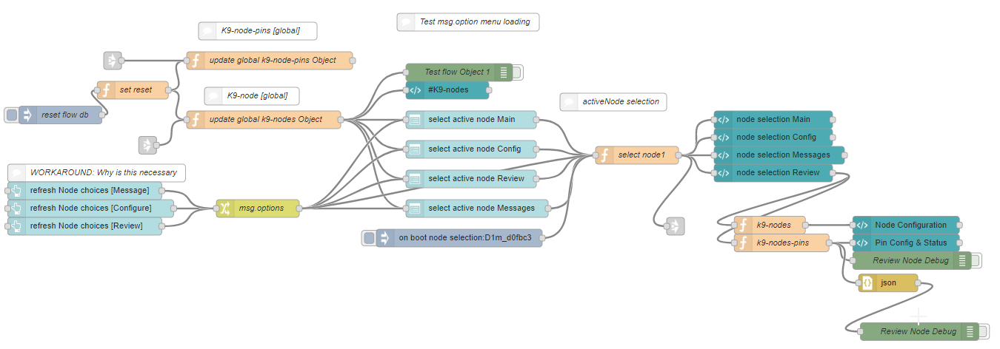

### [Update DB module] Tardis Node-Red System Control 
---

### Function

#### Create DB/Global context for active __k9nodes__
- create/update ObjectDB/Global context for k9node States
- create/update ObjectDB/Global context for K9 Pin States

#### Create a UI to Review the ObjectDB for a selected __k9node__
- select ActiveID __k9node__

---

### Node-Red Flow

---

### Browser UI
