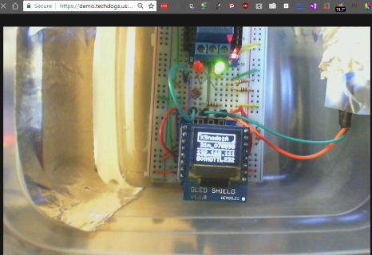

### remote sensing and control
---
#### the remote control center for the universe [Raspberry Pi, NodeMCU and Node-Red]

### >> [Live Demo System](http://demo.techdogs.us) << Clink on graphic to see the operation LIVE!

| Node-Red Web UI | Node-Red Control Panel [Main]  | Live Camera  |
|:-:|:-:|:-:|
||||
| **Configure** |**Message** | **Review** |
| | | |
| **Record** |**System**  |  |
| | |  |
